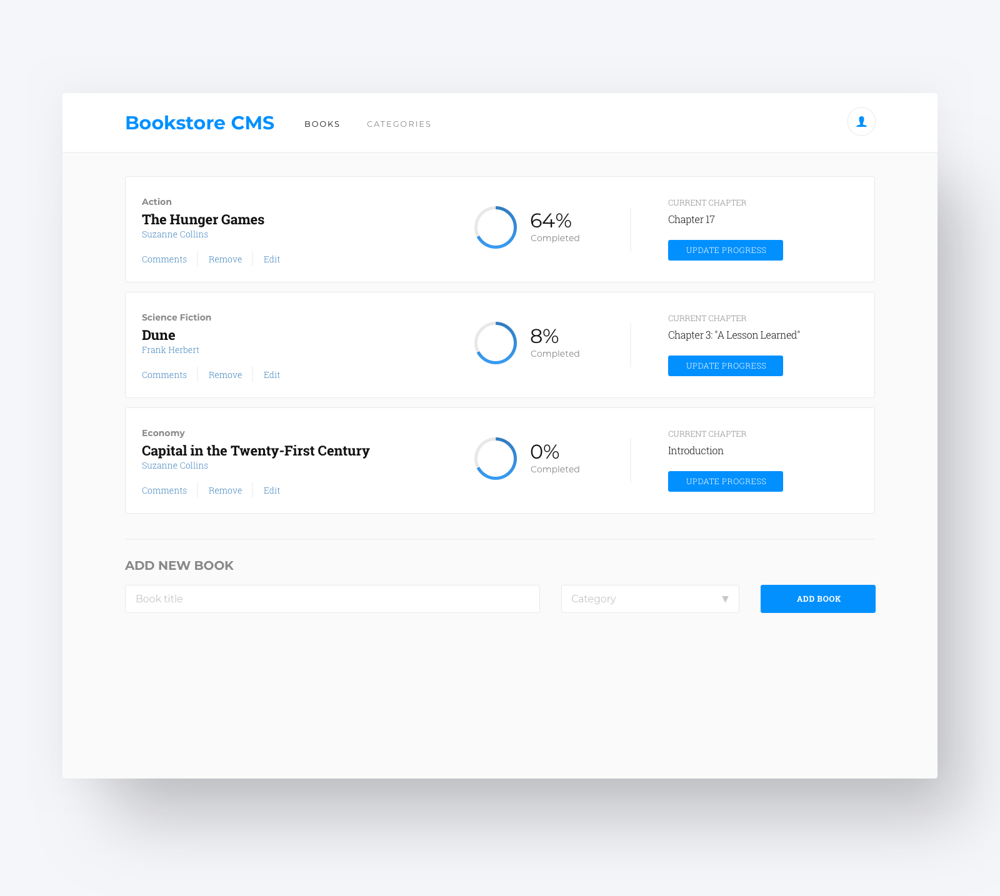

# My React BookStore Project (Module 3)

  
   

  <h3><b>My React BookStore Project</b></h3>

<!-- TABLE OF CONTENTS -->

# 📗 Table of Contents

- [📖 About the Project](#about-project)
  - [🛠 Built With](#built-with)
    - [Tech Stack](#tech-stack)
    - [Key Features](#key-features)
  - [🚀 Live Demo](#live-demo)
- [💻 Getting Started](#getting-started)
  - [Setup](#setup)
  - [Prerequisites](#prerequisites)
  - [Install](#install)
  - [Usage](#usage)
  - [Run tests](#run-tests)
  - [Deployment](#triangular_flag_on_post-deployment)
- [👥 Authors](#authors)
- [🔭 Future Features](#future-features)
- [🤝 Contributing](#contributing)
- [⭐️ Show your support](#support)
- [🙏 Acknowledgements](#acknowledgements)
- [❓ FAQ (OPTIONAL)](#faq)
- [📝 License](#license)

<!-- PROJECT DESCRIPTION -->

# 📖 [My-React-BookStore] 

**[My-React-BookStore]** is a website for all fans of books. It is a Single Page App (SPA) that allows users to:
    - [] add books.
    - [] delete books.
    - [] retrieve books from api.

## 🛠 Built With 

### Tech Stack 

  
Client

  <ul>
    <li><a href="https://reactjs.org/">React.js</a></li>
    <li>Redux</li>
    <li>React Router</li>
    <li><a href="https://html.com/">Html5</a></li>
    <li><a href="hhttps://www.w3schools.com/css/">CSS3</a></li>
    <li>JS</li>
    <li>ESLint</li>
    <li>StyleLints</li>
    <li>GitFlow</li>
    <li><a href="https://www.javascript.com/">ES6</a></li>
    <li>Webpack</li>
    <li>Jest</li>
  </ul>

  
Server

  <ul>
    <li><a href="#">N/A</a></li>
  </ul>

Database

  <ul>
    <li><a href="#">N/A</a></li>
  </ul>

<!-- Features -->

### Key Features 

- **[Dynamically]**
- **[Git-flow]**
- **[Good-HTML-JS-and-CSS-practices]**
- **[ES6-modules]**
- **[react-Jest-tests]**
- **[react-Webpack]**

<!-- LIVE DEMO -->

## 🚀 Live Demo 
[my-react-bookstore](https://aspiring-cup.surge.sh/)

(<a href="#readme-top">back to top</a>)

<!-- GETTING STARTED -->

## 💻 Getting Started 

To get a local copy up and running, follow these steps.

### Prerequisites

In order to run this project you need:

- A computer with node.js.
- Internet access.

### Setup

In order to run this project you need: clone this repo : [git@github.com:MMGGYY66/my-react-bookstore.git]

### Install

After cloning the repo you need to install de dependencies.
- Run this command in the project folder:
 <code>npm install</code>

### Usage

To run the project, execute the following command:

- Builds the app for production to the build folder. It correctly bundles React in production mode and optimizes the build for the best performance. run:
 <code>npm run build</code>

 - Runs the app in the development mode. Open http://localhost:3000 to view it in the browser: run
 <code>npm start</code>

### Run tests

To run tests, run the following command:
 <code>npm test</code>

### Deployment
<!-- [math-magicians](https://mmggyy66.github.io/my-react-bookstore/) -->

(<a href="#readme-top">back to top</a>)

<!-- AUTHORS -->

## 👥 Authors 

👤 **Mohamed Gamil Eldimardash**

- GitHub: [@github](https://github.com/MMGGYY66)
- LinkedIn: [LinkedIn](https://www.linkedin.com/in/mohamed-eldimardash-0023a3b5/)
- Twitter: [twitter](https://twitter.com/MOHAMEDELDIMARd)
- Facebook: [facebook](https://www.facebook.com/MOHAMED.ELDIMARDASH/)

(<a href="#readme-top">back to top</a>)

<!-- FUTURE FEATURES -->

## 🔭 Future Features 

- [ ] **[Create a directory called components.]**
- [ ] **[Inside components, create a new Books.js file.]**
- [ ] **[In Books.js, create a React component that matches given design]**
Project 2: Add reducers and actions.
Project 3: Use Redux in React components.
Project 4: Connect to API.
Project 5: Styling.

(<a href="#readme-top">back to top</a>)

<!-- CONTRIBUTING -->

## 🤝 Contributing 

Contributions, issues, and feature requests are welcome!

Feel free to check the [issues page](https://github.com/MMGGYY66/my-react-bookstore/issues/2).

(<a href="#readme-top">back to top</a>)

<!-- SUPPORT -->

## ⭐️ Show your support 

If you like this project take the time to give a star, follow me and a feedback, we will appreciate it.

(<a href="#readme-top">back to top</a>)

<!-- ACKNOWLEDGEMENTS -->

## 🙏 Acknowledgments 

I would like to thank Microverse for giving me the chance to improve my coding.

(<a href="#readme-top">back to top</a>)

<!-- FAQ (optional) -->

## ❓ FAQ (OPTIONAL) 
- **What is this for?**

  - This is a react.js project to practice working with react.js.

- **Can i copy this project?**

  - Your welcome, copy this project and let us know if you have any questions.

(<a href="#readme-top">back to top</a>)

<!-- LICENSE -->

## 📝 License 

This project is [MIT](https://github.com/MMGGYY66/my-react-bookstore/blob/bookstore-setup/MIT.md)

(<a href="#readme-top">back to top</a>)

